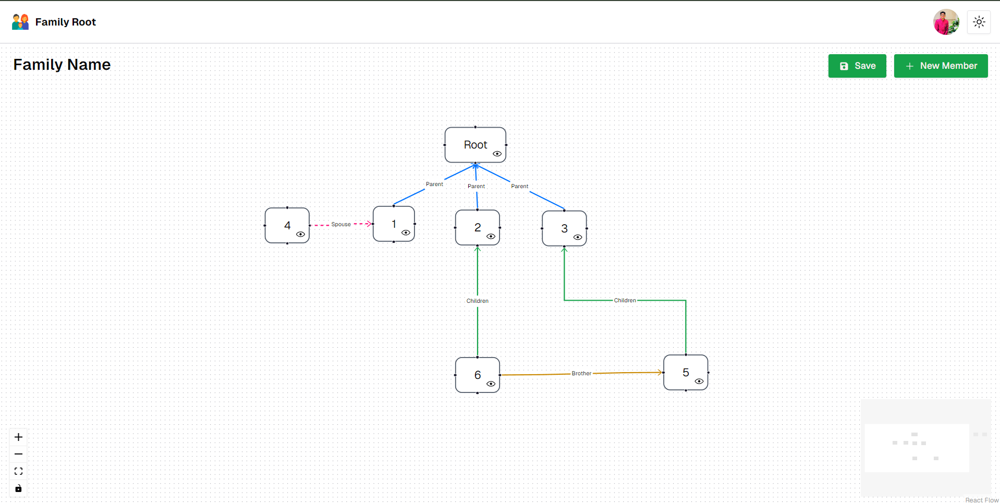

# **Family Tree Builder**

A modern family tree builder application where users can create, edit, and visualize their family trees interactively. This project is built using the **T3 Stack**, including **Next.js**, **tRPC**, **Prisma**, **TypeScript**, and **TailwindCSS**.



## **Features**

- 🧬 **Interactive Family Tree**: Easily add, edit, and remove family members with a dynamic tree structure.
- 🔄 **Real-Time Updates**: Changes to the family tree are instantly reflected in the UI.
- 🔐 **Data Persistence**: All changes are saved in a database using **Prisma**.
- 🌐 **Full-Stack**: End-to-end type safety with **tRPC**.
- 🎨 **Responsive Design**: Built with **TailwindCSS**, the app is fully responsive on mobile, tablet, and desktop.
- 📊 **Database**: Supports **MongoDB** via Prisma ORM.
- 🚀 **Deployed on Vercel**.

## **Tech Stack**

- **Framework**: [Next.js](https://nextjs.org/)
- **API**: [tRPC](https://trpc.io/)
- **Database**: [Prisma ORM](https://www.prisma.io/)
- **Styling**: [TailwindCSS](https://tailwindcss.com/)
- **Type Safety**: [TypeScript](https://www.typescriptlang.org/)
- **Visualization**: [React Flow](https://reactflow.dev/) for tree visualization
- **Deployment**: [Vercel](https://vercel.com/) (or your preferred platform)

## **Getting Started**

### Prerequisites

- [Node.js](https://nodejs.org/) >= 16.x
- [npm](https://npmjs.com/) or [yarn](https://yarnpkg.com/)
- MongoDB instance (configured in `.env`)

### Installation

1. **Clone the repository**:

   ```bash
   git clone https://github.com/kirtanp04/Family-Root.git

   ```
